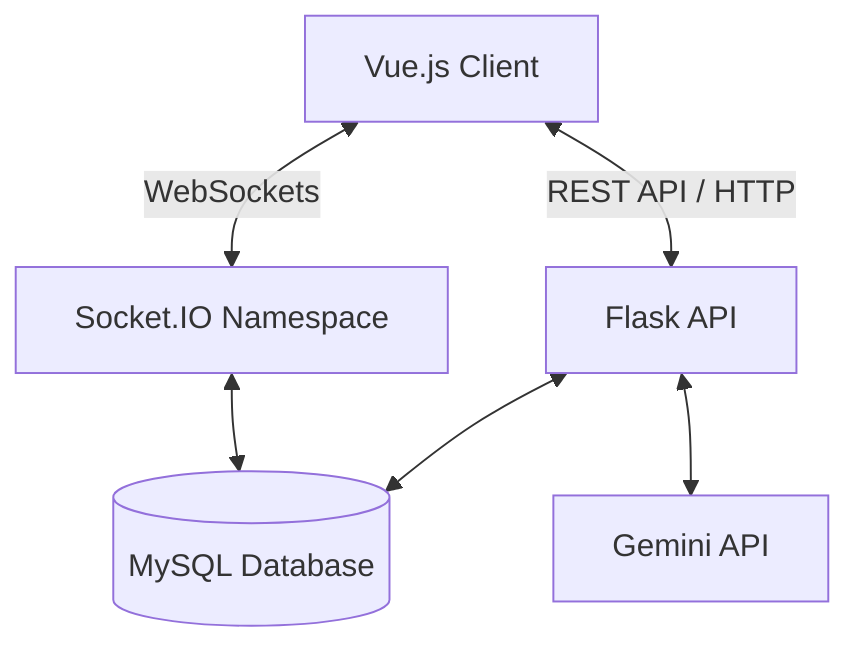

# InfoMap Chatbot Platform

## Introduction
The **InfoMap Chatbot Platform** facilitates the creation of mapped-information integrated with chatbots. It allows creators to build hierarchical information trees that users can explore visually or query via an AI assistant. The platform is designed to be easily exposed to the general public, enabling fast data querying through both drill-down navigation and conversational interfaces.

## System Architecture
The system follows a standard Client-Server architecture with real-time capabilities.

## Roles
- **Consumer (User)**: Explores information trees, chats with AI, and requests human support.
- **Creator**: Creates and manages chatbots, uploads JSON trees, and responds to support requests.
- **Administrator**: Oversees the system and moderates content.

## Tech Stack
- **Frontend**: Vue.js (SPA)
- **Backend**: Python (Flask) + Flask-SocketIO
- **Database**: MySQL / MariaDB
- **AI**: Google Gemini API

## Quick Start

### Backend
The backend handles the API, database interactions, and real-time socket events.
[Go to Backend Documentation](./backend/README.md)

### Frontend
*Coming Soon* - The frontend will be built using Vue.js.
[Go to Frontend Documentation](./frontend/README.md)
