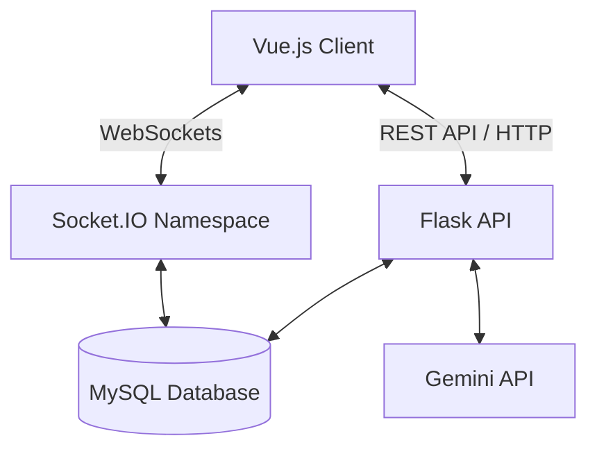

# Software Design Document: Build a chat

## 1. Introduction
The platform allows creators to build "Chatbots" based on hierarchical information trees. Users can explore this map, query an AI regarding the content, or escalate to a human chat with the creator.

### 1.1 Context & Background
The project aims to facilitate the creation of mapped-information integrated with chatbots. These chatbots are designed to be easily exposed to the general public, allowing users to query data faster through both visual navigation and conversational interfaces.

**Key Requirements:**
- **Users:** Three distinct roles defined as Users (consumers), Creators (builders), and Administrators (site managers).
- **Interaction:** Users navigate a directory-like tree structure (drill-down capacity). They can ask AI questions based on the current context or request human help, which triggers a private real-time chat with the creator.
- **Data Structure:** Information is modeled as a tree where nodes represent concepts or resources.

**Tech Stack:**
- **Frontend:** Vue.js.
- **Backend:** Python (Flask) with Socket.IO for real-time features.
- **Database:** Relational (MySQL/MariaDB).
- **AI:** Google Gemini.

**Creator Workflow:** Creators upload tree structures via JSON and manage visibility permissions. Users search for chatbots via title substrings.

### 1.2 Scope
- **Frontend:** Vue.js (SPA).
- **Backend:** Python Flask + Flask-SocketIO.
- **Database:** MySQL / MariaDB.
- **AI:** Google Gemini API.

## 2. System Architecture

### 2.1 High-Level Overview
The system follows a standard Client-Server architecture with real-time capabilities.



### 2.2 Roles
- **Consumer (User):** Explores trees, chats with AI, requests support.
- **Creator:** CRUDs chatbots, uploads JSON trees, responds to support requests.
- **Administrator:** System oversight, content moderation.

## 3. Database Design (Schema)
Below is the refined schema to support performance and the requirements.

### 3.1 Users Table
Stores authentication and profile data.
- `id` (PK, INT, Auto-increment)
- `username` (VARCHAR)
- `email` (VARCHAR, Unique)
- `password_hash` (VARCHAR)
- `role` (ENUM: 'admin', 'creator', 'user')
- `created_at` (DATETIME)

### 3.2 Chatbots Table
The header information for a project.
- `id` (PK, INT)
- `creator_id` (FK -> Users.id)
- `title` (VARCHAR) - Indexed for search
- `description` (TEXT)
- `visibility` (ENUM: 'public', 'private', 'link_only') - Handles permissions
- `is_active` (BOOLEAN) - For soft deletes or admin bans
- `created_at` (DATETIME)

### 3.3 Nodes Table
Represents the data points.
- `id` (PK, INT)
- `chatbot_id` (FK -> Chatbots.id) - Critical for fetching the whole tree in one query.
- `label` (VARCHAR)
- `content` (TEXT) - Detailed text/links for this node.
- `parent_node_id` (FK -> Nodes.id, Nullable) - Nullable if it is the Root.

**Design Decision:** We are proceeding with the Adjacency List model (`parent_node_id`) instead of a separate Edges table. This simplifies the schema for strict tree structures (where a child has only one parent). If the requirements evolve to support complex graphs (multi-parent nodes), an Edges table can be reintroduced.

### 3.4 Chat_Sessions Table
Manages the state of a conversation.
- `id` (PK, INT)
- `chatbot_id` (FK -> Chatbots.id)
- `user_id` (FK -> Users.id, Nullable) - Nullable allows guest AI chat.
- `type` (ENUM: 'ai_conversation', 'human_support')
- `status` (ENUM: 'active', 'resolved', 'archived')
- `created_at` (DATETIME)

### 3.5 Messages Table
- `id` (PK, INT)
- `chat_session_id` (FK -> Chat_Sessions.id)
- `sender_id` (FK -> Users.id, Nullable) - Null if sender is AI or System.
- `sender_type` (ENUM: 'user', 'creator', 'ai', 'system')
- `content` (TEXT)
- `created_at` (DATETIME) - Used for sorting.

## 4. Proposed Implementation Strategy

### 4.1 The "Map" (Tree) Visualization
- **Data Input:** Creator inputs the tree structure using a simple **indented text format** (user-friendly).
    ```text
    Root Concept
      Child Concept A
        Grandchild A1
      Child Concept B
    ```
- **Frontend Processing:** The frontend parses this indented string into a nested **JSON structure** before sending it to the backend.
    **Example JSON Payload:**
    ```json
    {
      "label": "Root Concept",
      "children": [
        {
          "label": "Child Concept A",
          "children": [
            { "label": "Grandchild A1", "children": [] }
          ]
        },
        {
          "label": "Child Concept B",
          "children": []
        }
      ]
    }
    ```
- **Backend:** Validates the JSON and recursively creates Nodes in the DB.
- **Data Retrieval:** When a user loads a chatbot: `SELECT * FROM nodes WHERE chatbot_id = X;`
    - **Backend Output:** The backend converts the flat list of nodes back into the **nested JSON structure** before sending it to the frontend.
- **Frontend Visualization:** Receive the flat list of nodes and use a utility function (e.g., `arrayToTree`) to convert them into a hierarchical object for the visualization library.
- **Visualization Library:** Use D3.js or Vue Flow (highly recommended for Vue) to render the interactive tree on the left/center of the screen.

### 4.2 AI Chat (Gemini Integration)
**Context Window:** When the user asks a question, we cannot send the entire tree every time if it's huge.
**Strategy:**
1. User is currently looking at Node A.
2. User asks: "How does this work?"
3. Backend constructs prompt:
    - **System Prompt:** "You are a helpful assistant explaining a diagram. Here is the context."
    - **Context:** Content of Node A + Content of Node A's immediate children.
    - **User Query:** "How does this work?"
4. Send to Gemini.
5. Stream response back to frontend.

### 4.3 Human Support (Real-time Socket.IO)
- **Initiation:** User clicks "Ask Creator".
- **API Action:**
    - Create `Chat_Session` (type='human_support').
    - Emit socket event `new_support_request` to the Creator's room.
- **Creator View:** Creator sees a notification. Clicks "Accept".
- **Socket Rooms:**
    - User joins room `session_{session_id}`.
    - Creator joins room `session_{session_id}`.
- **Messaging:**
    - Client emits `send_message`.
    - Server saves to DB -> Emits `receive_message` to room.

## 5. API Design (Endpoints)

### 5.1 REST API (Flask)
- `POST /auth/login`
- `POST /auth/register`
- `GET /chatbots?search=xyz` (Public search)
- `GET /chatbots/<id>` (Fetch tree data)
- `POST /chatbots` (Create new bot - accepts JSON tree)
- `PUT /chatbots/<id>` (Update tree)
- `POST /chatbots/<id>/ask-ai` (Endpoint for Gemini interaction - usually REST is easier than Socket for simple request/response AI).

### 5.2 Socket.IO Events
- `connect`: Authenticate user via token.
- `join_chat`: Join a specific session room.
- `chat_message`: Payload `{ session_id, message }`.
- `resolve_chat`: Creator marks as done.

## 6. Admin Panel Ideas
Since you asked for ideas on Admin interaction:
- **Global Activity Stream:** A live feed of new Chatbots created.
- **Report Handling:** If a user reports a Chatbot for misinformation/spam, it appears here. Admin can toggle `is_active = false`.
- **Stats:**
    - Most popular chatbots (by views).
    - Chatbots with most "Human Support" requests (implies the information tree is confusing or the AI is failing).

## 7. Context for AI Tools (Development Prompts)
Use these prompts when asking me or other AIs to write the code.

**Prompt for Database Setup:**
"Create a Flask-SQLAlchemy model structure based on the schema: Users, Chatbots, Nodes, ChatSessions, Messages. Ensure Chatbots has a One-to-Many relationship with Nodes. Use MySQL dialects."

**Prompt for Tree Upload:**
"Write a Python function that takes a nested JSON object representing a tree (with 'label', 'content', and 'children' keys) and recursively saves it to the Nodes table using SQLAlchemy, assigning the correct parent_ids."

**Prompt for Frontend Graph:**
"Create a Vue 3 component using Vue Flow (or D3) that fetches a list of nodes from an API, converts them into a graph structure, and allows the user to click a node to view its details in a sidebar."
